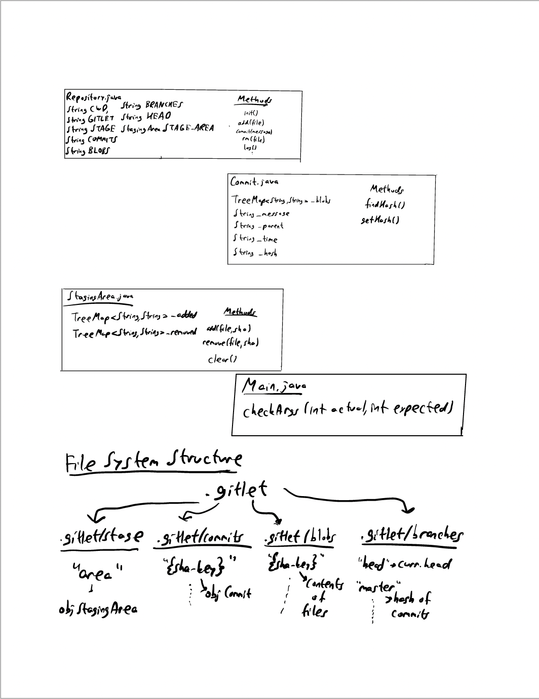

# Gitlet Design Document
author: Kerem Dilmen
 

## 1. Classes and Data Structures

###Main
This class creates a new Repository object and handles the input command.

##Repository
Class for all the functionality of the git repository for Gitlet.
Includes methods for each possible command.

**Fields**
1. String CWD = Path for the current working directory.
2. String GITLET = Path for .gitlet directory.
3. String STAGE = Path for stage directory.
4. String COMMITS = Path for commits directory.
5. String BLOBS = Path for blobs directory.
6. String BRANCHES = Path for branches directory.
7. String HEAD = HEAD pointer that keep track of the latest commit on the current branch. Set to "master" by default.
8. StagingArea STAGE_AREA = Staging area of this repository.

###Commit
Class to store the properties of a given commit for Gitlet.

**Fields**
1. TreeMap<String, String> _blobs: A map that stores a mapping of each file to its corresponding SHA-1 key.
2. String _message: The message of this commit.
3. String _parent: SHA-1 key of this commit's parent.
4. String _time: Date and time of this commit.
5. String _hash: SHA-1 key of this commit.

###StagingArea
Class to track added and removed files for Gitlet.

**Fields**
1. TreeMap<String, String> _added: A map for the added files and their SHA-1 keys.
2. TreeMap<String, String> _removed: A map to store the removed files.

## 2. Algorithms

###Main

The class uses a switch on the input to determine which command should be used.
If the command doesn't exist, prints "No command with that name exists."

1.static boolean checkArgs(): Takes in length of args and the expected number of inputs.
Returns true iff they are equal, prints "Incorrect operands." and returns false otherwise.

###Repository

1.Repository(): Since a new Repository object is created with each input, we need to restore
head and staging area to their most recent values. The constructor checks if a file called head
exists in the branches directory and sets head to its content if it does. The same thing is done for staging area
where the constructor checks if a file called area exists in the stage directory.

2.public void init(): Initializes a git repository if it doesn't exist. Creates a .gitlet directory and all of its sub-directories.
Creates an initial commit with the message "initial commit" and saves this object into the commits directory where
the file name is the SHA-1 key of the commit. Creates a file called head inside the branches directory and stores "master" inside.
Also creates another file called master in the branches directory and stores the initial commit's hash. Finally, creates a new StagingArea object
and stores this object in a file called area in the stage directory.

###Commit

1.Commit(TreeMap<String, String> blobs, String message, String parent): Sets
the _blobs, _message, and _parent variables to the inputs. Sets _hash using the findHash() method of the class.
Sets _time using LocalDateTime.now() with an appropriate formatter.

2.private String findHash(): Calculates and returns the SHA-1 key of this commit by serializing it.

3.public String getHash(): Returns the SHA-1 key of this commit.

###StagingArea

1. StagingArea(): Only calls the clear() method of this class.
2. public void add(String file, String sha): Adds the file to the staging area along with its SHA-1 key.
3. public void remove(String file, String sha): Adds the removed file to the staging area along with its SHA-1 key.
4. public void clear(): Resets the maps _added and _removed. Removes all added and removed files from the staging area.

## 3. Persistence

.gitlet directory includes the directories stage, commits, blobs, and branches to achieve persistence.

1.The stage directory will include a file called area that stores the most recent state of the staging area.
This is used in the constructor of the Repository class to set the STAGING_AREA variable to the most recent 
StagingArea object.

2.Commits directory will include a file for each commit. The name of the file will be the SHA-1 key
of the commit and the file will contain the commit object that has the same SHA-1 key. So, whenever we want to go back to
a previous commit, we will just use the relevant file and extract the Commit object within.

3.Blobs directory will include all the files that will be used in the git repository. Similar to commits directory,
the name of file in the directory will be the SHA-1 key of the file that is added and the contents will be copied so that
they can be restored whenever necessary.
  
4.Branches directory will keep track of all the branches that are created as well as the head pointer.
This directory will include a file called head that includes the name of the current head as String which is used in the 
Repository constructor to restore the HEAD variable. The other files that will be included will have the names of the branches, starting with master. 
These files will store the SHA-1 keys of their commits which will be used to restore those commits later on.

## 4. Design Diagram

